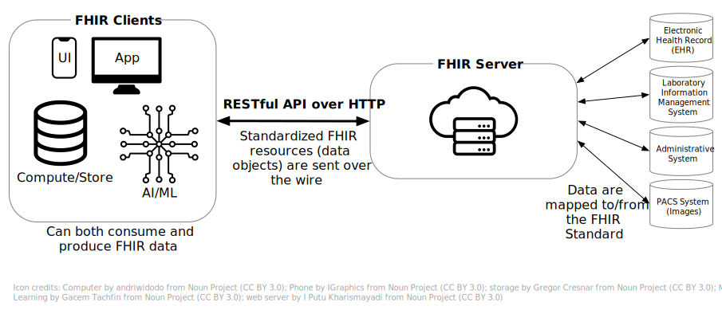
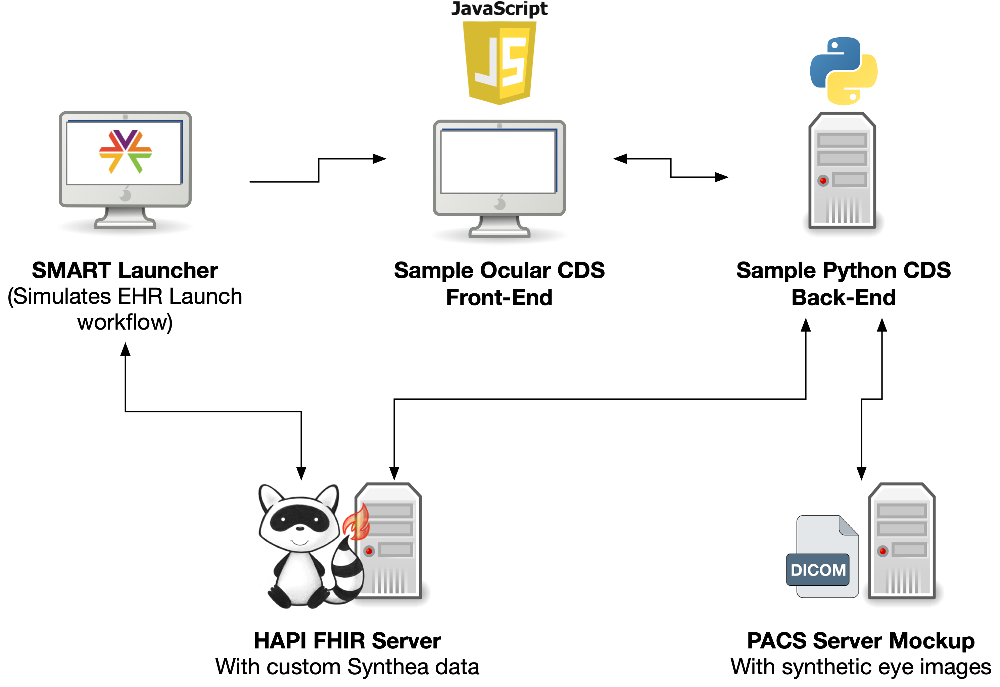
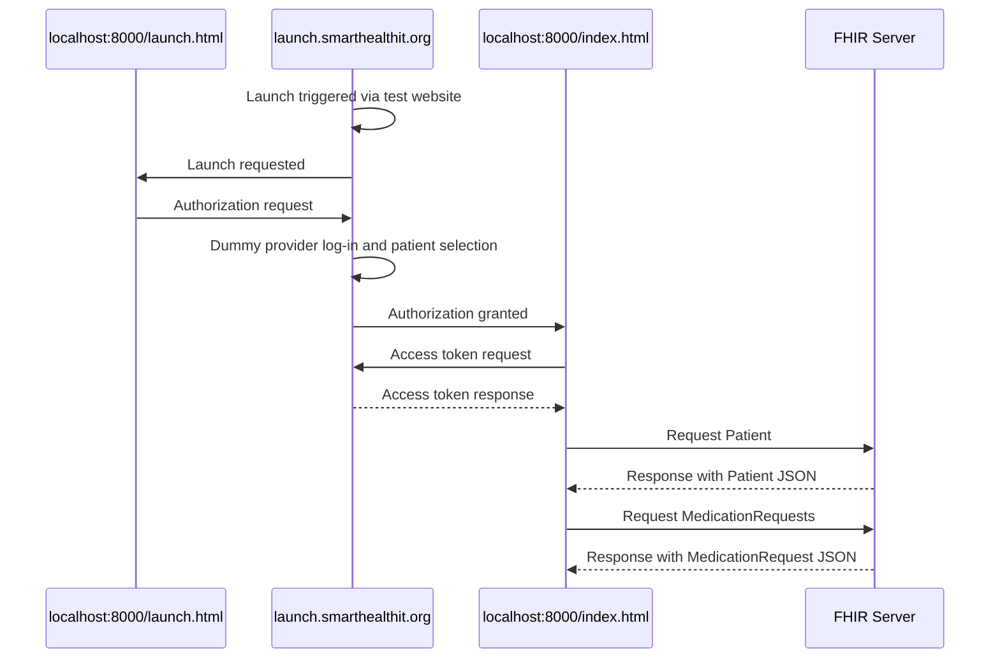

# SMART on FHIR<sup>®</sup> for Eye Health Research Workshop

National Eye Institute, Office of Data Science and Health Informatics

May 30, 2024 <br><br><br>

<small>FHIR® is the registered trademark of Health Level Seven International (HL7). Use of the FHIR trademark does not constitute an HL7 endorsement of this workshop.<br><br> © 2024 The MITRE Corporation / Approved for Public Release / Case \#24-0169</small>

## Workshop Overview

<div class="incremental">

- Today’s use case: creating a novel clinical decision support (CDS) tool for ophthalmology that integrates into an electronic health record (EHR) workflow

- We will identify and work hands-on with the parts of the FHIR ecosystem that support this use case

- Workshop content is organized from least-to-most technical

  - No prior FHIR experience or other technical skills\* are needed

  - \*Except for at the very end of the workshop: we will be working hands-on with Python

</div>

## Logistics

<div class="incremental">

- Workshop “homepage”: <a href="https://github.com/NIH-NEI/fhir-for-research-workshop/" data-preview-link="false">https://github.com/NIH-NEI/fhir-for-research-workshop/</a>
- Contacting us after the workshop: `neiodshi@nei.nih.gov`
- There is a survey! <https://forms.office.com/g/pBhCxFxtpw>

</div>

## Agenda

<div class="r-fit-text">

**Part 1: Overview of…**

1.  FHIR
2.  SMART on FHIR
3.  Example clinical decision support system

**Part 2: Deep dive into…**

1.  Reading the FHIR specification and FHIR IGs
2.  FHIR API
3.  SMART on FHIR log-in and permissions (authentication and authorization) workflow

**Part 3: Hands-on with…**

1.  FHIRPath
2.  Python code to access FHIR data

</div>

# 1.1 FHIR Overview

<div class="notes">

We will start with a high level overview of FHIR and flag the relevant parts of the FHIR ecosystem for this use case.

</div>

## What is FHIR?

FHIR stands for:

- Fast (to design & implement)
- Healthcare
- Interoperability
- Resources (aka building blocks)

FHIR® is a standard for exchanging health information electronically.

Standards establish a common language and process for all health information technology (IT) systems to communicate, allowing information to be shared seamlessly and efficiently.

## Real world examples of FHIR

- [Apple Health](https://www.apple.com/healthcare/health-records/) and patient portals
- [SMART Health Cards](https://smarthealth.cards/en/)
- [Health information exchange networks](https://www.aha.org/news/headline/2024-04-22-onc-requires-health-information-exchange-networks-support-fhir-standard) under TEFCA

## What characteristics of FHIR support its broad implementation?

- **Free:** It is an open, free-to-use standard.
- **Modular:** “Resources” are used to build solutions from compatible components.
- **Customizable:** Developers and implementers can use extensions and profiling to meet specific needs.

## What do you get with FHIR?

- The FHIR specification: <a href="https://hl7.org/fhir/" data-preview-link="false">https://hl7.org/fhir/</a>

  - Common data format, typically [JSON](https://www.hl7.org/fhir/us/core/Patient-example.json.html) or [XML](https://www.hl7.org/fhir/us/core/Patient-example.xml.html)

  - Standard data elements grouped into “<a href="https://www.hl7.org/fhir/resourcelist.html" data-preview-link="false">resources</a>”

  - [Standard API](https://www.hl7.org/fhir/http.html)

- Customization via FHIR implementation guides (e.g., <a href="https://www.hl7.org/fhir/us/core/" data-preview-link="false">US Core</a>; [others](http://fhir.org/guides/registry/))

  - The base FHIR specification is typically too general to support a specific use case; FHIR IGs allow for use case-specific customization and extension

## FHIR system architecture



<div class="notes">

Our ophthalmology CDS use case fits into this architecture: we have two different FHIR clients working together that talk to a FHIR server.

</div>

## FHIR’s RESTful API

- Provides a uniform interface between FHIR-enabled systems that allows them to talk to each other

- REST = [representational state transfer](https://en.wikipedia.org/wiki/REST)

- Practically, allows you to construct a URL like <a href="http://hapi.fhir.org/baseR4/Patient/44728118" data-preview-link="false"><code>http://hapi.fhir.org/baseR4/Patient/44728118</code></a> to retrieve specific information

  - Base: `http://hapi.fhir.org/baseR4`

  - Resource: `Patient`

  - Id: `44728118`

## FHIR’s RESTful API, continued

- More complex retrieval is possible via the FHIR API:

  - Get a patient with a specific MRN: <a href="http://hapi.fhir.org/baseR4/Patient/?identifier=68519946" data-preview-link="false"><code>http://hapi.fhir.org/baseR4/Patient/?identifier=68519946</code></a>

  - Get all patients who have a specific kind of observation: <a href="http://hapi.fhir.org/baseR4/Patient/?_has:Observation:subject:code=41633001" data-preview-link="false"><code>http://hapi.fhir.org/baseR4/Patient/?_has:Observation:subject:code=41633001</code></a>

- Sending data, updating data, etc. have similar standardized interfaces

  - Custom interfaces can be created with FHIR IGs

## FHIR’s RESTful API, continued

- **Why is the FHIR API important for our ophthalmology CDS use case?  
  **The same interfaces work across “all” FHIR servers, allowing for software portability.

# 1.2 SMART on FHIR Overview

## What is SMART on FHIR?

> The goal of the original SMART on FHIR API is audacious and can be expressed concisely: an innovative app developer can write an app once and expect that it will run anywhere in the health care system.
>
> …
>
> SMART provides a full stack of open specifications that enable a medical apps platform.

— <https://smarthealthit.org/smart-on-fhir-api/>

## What is SMART on FHIR?

- SMART stands for “Substitutable Medical Apps, Reusable Technology”, a standard by the [SMART Health IT](https://smarthealthit.org/) group

- Based on open standards: FHIR, OAuth2, OpenID Connect

- Widely implemented/used (e.g., used on [all iPhones](https://www.apple.com/healthcare/health-records/) for connecting to patient portals)

- Required as part of ONC certification for 21<sup>st</sup> Century Cures Act: [§170.315(g)(10) Standardized API for patient and population services](https://www.healthit.gov/test-method/standardized-api-patient-and-population-services)

  - [§ 170.215(a)(4)](https://www.law.cornell.edu/cfr/text/45/170.215) lists the specific APIs including SMART Application Launch

<div class="notes">

- 45 CFR 170.315(g)(10) is:
  - In Title 45 of the Code of Federal Regulations
  - Part 170, Section 315, Paragraph 170.315(g)(10)
  - [More information on how the CFR is structured](https://www.archives.gov/files/federal-register/tutorial/tutorial_060.pdf)
  - Text of the CFR: <https://www.ecfr.gov/current/title-45/subtitle-A/subchapter-D/part-170/subpart-C/section-170.315#p-170.315(g)(10)>

</div>

## How can SMART on FHIR help research?

SMART on FHIR lets you:

- Integrate with an EHR (e.g., add an AI-driven CDS app)
- Add patient-generated data to an EHR workflow
- Create an app that can be used across institutions and EHR products (“write once, use everywhere”)
- Access [Bulk Data](../bulk-data/index.html)

## SMART on FHIR standards

It ties together existing common web standards and HL7 specifications to enable secure EHR integration:

- OAuth2 for authorizing a third-party app (“logging in”)
- OpenID Connect for authenticating a patient or provider (“permissions”)
- HL7 FHIR for data modeling and API
- JSON for the data format
- [HL7.FHIR.UV.SMART-APP-LAUNCH](http://hl7.org/fhir/smart-app-launch/) standard for launching from EHR
- [HL7 CDS Hooks](https://cds-hooks.hl7.org) for triggering based on EHR actions (see next slide)

## Aside: CDS Hooks

- CDS Hooks is an HL7 standard that can support SMART on FHIR application integration with EHRs
- They allow an action in an EHR to trigger an action in a third-party application
- For example, a [`patient-view`](https://cds-hooks.org/hooks/patient-view/) hook is triggered when the patient record is opened, which could then call natural language processing software

## Technical considerations

#### SMART apps have multiple authorization patterns

- SMART App Launch
  - EHR Launch: user launches an application from within an EHR (ex: a CDS app)
  - Standalone Launch: user launches the application directly (ex: iPhone Health app)
- SMART Backend Service: support applications that run autonomously (ex: data pipeline)

## Technical considerations, continued

#### Security

- Use reputable open-source software libraries to save development time and avoid common security pitfalls. [SMART Health IT](http://docs.smarthealthit.org/) lists SMART-on-FHIR software libraries.

#### Privacy

- FHIR servers will likely return sensitive healthcare data. PHI rules will likely apply. You must also comply with your institution’s IRB and privacy rules.

## Technical considerations, continued

#### Design

- If you are developing a user-facing application, consider a [human-centered design](https://en.wikipedia.org/wiki/Human-centered_design) approach to help ensure good user experience.
- More: <https://www.fastcompany.com/90772846/human-centered-design>

# 1.3 Example CDS System

## Example CDS system architecture

<figure>

<figcaption aria-hidden="true">Diagram of example CDS system architecture used for this workshop.</figcaption>
</figure>

# SMART App Launch workflow + sample app demo

## SMART App Launch workflow

- Described in detail in the [SMART App Launch spec](http://www.hl7.org/fhir/smart-app-launch/app-launch.html#top-level-steps-for-smart-app-launch)
- Diagram specific to this workshop on next slide
- We will be using <https://launch.smarthealthit.org> to simulate EHR launch
  - Some differences vs. production implementation

------------------------------------------------------------------------



## Basic sample app

<div class="r-fit-text">

- Source: <https://purl.org/fhir-for-research/workshops/smart-on-fhir/sample-app-git>
- Explanation: <https://purl.org/fhir-for-research/web/modules/smart-on-fhir-tech>
- Options for accessing sample app:
  - Should be running on `http://localhost:3000` for you
  - Also available at <https://purl.org/fhir-for-research/workshops/smart-on-fhir/sample-app-build>
- Go to <https://launch.smarthealthit.org>
  - Enter URL for sample app’s `launch.html` page into “App’s Launch URL” and click “Launch”

</div>

## Video of launch sample app via SMART App Launch

<!-- THIS FAILS  -->

<video src="smart-on-fhir-flow.mp4" data-fig-alt="video showing smart-on-fhir flow" controls=""><a href="smart-on-fhir-flow.mp4">Video</a></video>

Link to video: <https://purl.org/fhir-for-research/workshops/smart-on-fhir/flow-video>

## Basic sample app structure

``` ascii
smart-on-fhir-demo/
     |
     +--- launch.html
     |
     +--- index.html
```

<br />

You can copy file contents from <https://purl.org/fhir-for-research/workshops/smart-on-fhir/sample-app-git>.

<br />

If you cloned the repository this is already done.

------------------------------------------------------------------------

**SMART on FHIR walkthrough**

### Step 1. *launch.smarthealthit.org* simulates an EHR and triggers a SMART App Launch

Your browser (a client) gets redirected by the EHR to your app’s <http://localhost:3000/launch.html> with the following parameters:

- `iss`: Identifies the EHR’s endpoint for the app
- `launch`: An opaque identifier for this specific app launch and EHR context, required for security purposes
  - JavaScript librar automatically passes this back to EHR with authorization request (Step 2)

------------------------------------------------------------------------

**SMART on FHIR walkthrough**

### Step 2. Your app’s `launch.html` executes an authorization request with select parameters

- We are using the [SMART on FHIR JavaScript Library](https://docs.smarthealthit.org/client-js/) from SMART Health IT
- This library handles the OAuth2 workflow and making authenticated requests from the FHIR server

------------------------------------------------------------------------

**SMART on FHIR walkthrough**

### Step 2. Your app’s `launch.html` executes an authorization request with select parameters

``` javascript
<script>
    FHIR.oauth2.authorize({

      // The client_id that you should have obtained after registering a client at
      // the EHR.
      //
      // Note that this can be an arbitrary string when testing with
      // http://launch.smarthealthit.org.
      clientId: "my_web_app",

      // The scopes that you request from the EHR. In this case we want to:
      // launch            - Get the launch context
      // openid & fhirUser - Get the current user
      // patient/*.read    - Read patient data
      scope: "launch openid fhirUser patient/*.read",

      // Typically, if your redirectUri points to the root of the current directory
      // (where the launchUri is), you can omit this option because the default value is
      // ".". However, some servers do not support directory indexes so "." and "./"
      // will not automatically map to the "index.html" file in that directory.
      redirectUri: "index.html"
    });
</script>
```

------------------------------------------------------------------------

**SMART on FHIR walkthrough**

The `clientId` parameter is a specific string obtained after registering the app in the EHR manually. Replace `"my_web_app"` with your specific app identifier.

``` javascript
<script>
    FHIR.oauth2.authorize({

      // The client_id that you should have obtained after registering a client at
      // the EHR.
      //
      // Note that this can be an arbitrary string when testing with
      // http://launch.smarthealthit.org.
      clientId: "my_web_app",

      // The scopes that you request from the EHR. In this case we want to:
      // launch            - Get the launch context
      // openid & fhirUser - Get the current user
      // patient/*.read    - Read patient data
      scope: "launch openid fhirUser patient/*.read",

      // Typically, if your redirectUri points to the root of the current directory
      // (where the launchUri is), you can omit this option because the default value is
      // ".". However, some servers do not support directory indexes so "." and "./"
      // will not automatically map to the "index.html" file in that directory.
      redirectUri: "index.html"
    });
</script>
```

------------------------------------------------------------------------

**SMART on FHIR walkthrough**

The `scope` parameter specifies what kinds of data the app needs access to. See [SMART on FHIR scope and lunch context](https://hl7.org/fhir/smart-app-launch/STU2/scopes-and-launch-context.html) for more data access options.

``` javascript
<script>
    FHIR.oauth2.authorize({

      // The client_id that you should have obtained after registering a client at
      // the EHR.
      //
      // Note that this can be an arbitrary string when testing with
      // http://launch.smarthealthit.org.
      clientId: "my_web_app",

      // The scopes that you request from the EHR. In this case we want to:
      // launch            - Get the launch context
      // openid & fhirUser - Get the current user
      // patient/*.read    - Read patient data
      scope: "launch openid fhirUser patient/*.read",

      // Typically, if your redirectUri points to the root of the current directory
      // (where the launchUri is), you can omit this option because the default value is
      // ".". However, some servers do not support directory indexes so "." and "./"
      // will not automatically map to the "index.html" file in that directory.
      redirectUri: "index.html"
    });
</script>
```

------------------------------------------------------------------------

**SMART on FHIR walkthrough**

`redirectUri` is where the EHR will redirect the web browser (client) to after authorization. In this case it is the app’s `index.html`.

``` javascript
<script>
    FHIR.oauth2.authorize({

      // The client_id that you should have obtained after registering a client at
      // the EHR.
      //
      // Note that this can be an arbitrary string when testing with
      // http://launch.smarthealthit.org.
      clientId: "my_web_app",

      // The scopes that you request from the EHR. In this case we want to:
      // launch            - Get the launch context
      // openid & fhirUser - Get the current user
      // patient/*.read    - Read patient data
      scope: "launch openid fhirUser patient/*.read",

      // Typically, if your redirectUri points to the root of the current directory
      // (where the launchUri is), you can omit this option because the default value is
      // ".". However, some servers do not support directory indexes so "." and "./"
      // will not automatically map to the "index.html" file in that directory.
      redirectUri: "index.html"
    });
</script>
```

------------------------------------------------------------------------

**SMART on FHIR walkthrough**

### Step 3. The EHR securely authorizes (or rejects) your request.

<br />

The demo EHR had you select a provider and patient in this phase. In the real world an EHR may already pull this information from context, or show another screen specifically asking a patient to give permission for access.

------------------------------------------------------------------------

**SMART on FHIR walkthrough**

### Step 4. Your web browser gets redirected to the app’s `index.html`

As requested earlier in your `redirectUri` parameter.


------------------------------------------------------------------------

**SMART on FHIR walkthrough**

### Step 5. The app obtains an access token via `FHIR.oauth2.ready()`

This access token gets embedded in a `client` object to authenticate and authorize future FHIR queries.

``` javascript
<script type="text/javascript">
    FHIR.oauth2.ready().then(function(client) {

        // Render the current patient (or any error)
        client.patient.read().then(
            function(pt) {
                document.getElementById("patient").innerText = JSON.stringify(pt, null, 4);
            },
            function(error) {
                document.getElementById("patient").innerText = error.stack;
            }
        );

        // Get MedicationRequests for the selected patient
        client.request("/MedicationRequest?patient=" + client.patient.id, {
            resolveReferences: [ "medicationReference" ],
            graph: true
        })

        // Reject if no MedicationRequests are found
        .then(function(data) {
            if (!data.entry || !data.entry.length) {
                throw new Error("No medications found for the selected patient");
            }
            return data.entry;
        })


        // Render the current patient's medications (or any error)
        .then(
            function(meds) {
                document.getElementById("meds").innerText = JSON.stringify(meds, null, 4);
            },
            function(error) {
                document.getElementById("meds").innerText = error.stack;
            }
        );

    }).catch(console.error);
</script>
```

------------------------------------------------------------------------

**SMART on FHIR walkthrough**

### Step 6. The app performs a Patient read FHIR query…

…and writes the raw JSON data in the app’s patient box. A real world application should parse the JSON into something more useful.

``` javascript
<script type="text/javascript">
    FHIR.oauth2.ready().then(function(client) {

        // Render the current patient (or any error)
        client.patient.read().then(
            function(pt) {
                document.getElementById("patient").innerText = JSON.stringify(pt, null, 4);
            },
            function(error) {
                document.getElementById("patient").innerText = error.stack;
            }
        );

        // Get MedicationRequests for the selected patient
        client.request("/MedicationRequest?patient=" + client.patient.id, {
            resolveReferences: [ "medicationReference" ],
            graph: true
        })

        // Reject if no MedicationRequests are found
        .then(function(data) {
            if (!data.entry || !data.entry.length) {
                throw new Error("No medications found for the selected patient");
            }
            return data.entry;
        })


        // Render the current patient's medications (or any error)
        .then(
            function(meds) {
                document.getElementById("meds").innerText = JSON.stringify(meds, null, 4);
            },
            function(error) {
                document.getElementById("meds").innerText = error.stack;
            }
        );

    }).catch(console.error);
</script>
```

------------------------------------------------------------------------

**SMART on FHIR walkthrough**

### Step 7. The app performs a MedicationRequest search query by Patient…

…and later writes the raw data in the app’s medication box.

``` javascript
<script type="text/javascript">
    FHIR.oauth2.ready().then(function(client) {

        // Render the current patient (or any error)
        client.patient.read().then(
            function(pt) {
                document.getElementById("patient").innerText = JSON.stringify(pt, null, 4);
            },
            function(error) {
                document.getElementById("patient").innerText = error.stack;
            }
        );

        // Get MedicationRequests for the selected patient
        client.request("/MedicationRequest?patient=" + client.patient.id, {
            resolveReferences: [ "medicationReference" ],
            graph: true
        })

        // Reject if no MedicationRequests are found
        .then(function(data) {
            if (!data.entry || !data.entry.length) {
                throw new Error("No medications found for the selected patient");
            }
            return data.entry;
        })


        // Render the current patient's medications (or any error)
        .then(
            function(meds) {
                document.getElementById("meds").innerText = JSON.stringify(meds, null, 4);
            },
            function(error) {
                document.getElementById("meds").innerText = error.stack;
            }
        );

    }).catch(console.error);
</script>
```

# FHIR API

## FHIR API basics

- Generally speaking the pattern for a RESTful GET query appended to a URL will take the form of:

  `VERB [base]/[Resource] {?param=[value]}`

- Spec: <https://hl7.org/fhir/R4/http.html>

## Aside: utility of open endpoint + synthetic data

- Real-world FHIR servers will require authentication/authorization
  - Handled by the [fhirclient](https://github.com/smart-on-fhir/client-js) library in our example
- But it can be helpful to have an open testing server (with synthetic data only!)
  - [Synthea](https://purl.org/fhir-for-research/synthea) synthetic data
  - [Logica Sandbox](https://sandbox.logicahealth.org)

## FHIR API - try it!

<div class="r-fit-text">

- Using our Logica Sandbox open endpoint:<br>`https://api.logicahealth.org/FHIRResearchSynthea/open`
  - This is pre-loaded with Synthea data from <https://synthea.mitre.org/downloads>
- “Playground” JavaScript:<br><https://purl.org/fhir-for-research/workshops/smart-on-fhir/playground>

</div>

## FHIR API - getting more data

- FHIR breaks up health information into chunks of data (**resources**) which are connected together via references
  - More information: <https://purl.org/fhir-for-research/key-fhir-resources>
  - List of all resources: <https://www.hl7.org/fhir/resourcelist.html>
- `GET [base]/Patient/1234` retrieves an **instance** of the [Patient](https://www.hl7.org/fhir/patient.html) resource

## FHIR API - getting more data

- [MedicationRequest](https://www.hl7.org/fhir/medicationrequest.html) has medication information, and is connected to Patient via `MedicationRequest.subject`
- `GET [base]/MedicationRequest?subject=1234` will get the instances of MedicationRequest for `Patient/1234`
- Results are returned in an instance of [Bundle](https://www.hl7.org/fhir/bundle.html)

## FHIR API - chaining

<div class="r-fit-text">

- `MedicationRequest.subject` has a reference back to Patient, allowing us to retrieve instances if we know the patient’s ID
- What if you only know the patient’s last name?
  - We could do **two queries**: one to get the ID with `GET [base]/Patient?name=peter`, and then a second to get the MedicationRequests for patients with that ID
  - The FHIR API supports **just one query**: `GET [base]/MedicationRequest?subject.name=peter`
  - Note that `MedicationRequest.subject` [can be either a Patient or Group](https://www.hl7.org/fhir/medicationrequest.html), so this is better: `GET [base]/MedicationRequest?subject:Patient.name=peter`

</div>

## FHIR API - reverse chaining

<div class="r-fit-text">

**What about “patients diagnosed with a given condition”?**

- The [Condition](https://www.hl7.org/fhir/condition.html) resource references a Patient (or Group) in `Condition.subject`
- The `_has` parameter supports retrieving Patients based on a value from a Condition
  - `:` separates fields
  - Sub-parameters:
    - The resource type to search for references back from (`Condition`)
    - The field on that resource which would link back to the current resource (`subject`)
    - A field on that resource to filter by (`code`, which Condition uses to identify the condition)
- Example: `GET [base]/Patient?_has:Condition:subject:code=195662009`

</div>

## FHIR API - chaining documentation

<https://hl7.org/fhir/search.html#chaining>

## FHIR API - searching multiple values

- Logical `AND` to find `john smith`: `GET [base]/Patient?given=john&family=smith`
- Logical `OR` to find `john smith` or `jenny smith`: `GET [base]/Patient?given=john,jenny&family=smith`
- *Lots* more in the spec: <https://hl7.org/fhir/search.html#combining>

# US Core

## US Core

- FHIR implementation of [U.S. Core Data for Interoperability (USCDI)](https://www.healthit.gov/isa/united-states-core-data-interoperability-uscdi)
- Conformance to US Core is part of ONC’s EHR certification program, so adoption is wide-spread in production EHRs
- Review the spec to understand available data elements: <https://www.hl7.org/fhir/us/core/>
  - How to read FHIR specs: <https://purl.org/fhir-for-research/data-modeling-reading-igs>

# FHIRPath

## FHIRPath

- <http://hl7.org/fhirpath/>:

  > FHIRPath is a path based navigation and extraction language, somewhat like XPath

- Useful for extracting data from FHIR’s deeply nested data structure

- JavaScript implementation: <https://github.com/HL7/fhirpath.js>

  - Sandbox: <https://hl7.github.io/fhirpath.js/>
    - ️*Not for use with real patient data!*

## FHIRPath examples

Try in the sandbox: <https://hl7.github.io/fhirpath.js/>

- Get the value from `Patient.gender`: `Patient.gender`

- Get a patient’s legal last name: `Patient.name.where(use='official').family`

- Get a patient’s MRN:

      Patient.identifier.where(type.coding.system = 'http://hl7.org/fhir/v2/0203' and type.coding.code = 'MR').value

# Hands-on: make your own SMART on FHIR app

## Hands-on prompt

- Create a decision support tool to identify medication interactions for a given patient
- Assume this will be launched via clicking a button in the EHR (SMART App Launch)
  - Could be embedded in an `<iframe>` to show inline as well – it’s the same mechanism
- Use FHIR to retrieve the MedicationRequest instances for a given patient
- Use the [RXNorm API](https://lhncbc.nlm.nih.gov/RxNav/APIs/api-Interaction.findInteractionsFromList.html) to check for drug/drug interactions
- Display the patient’s conditions, medications, and flag any drug/drug interactions

## Hands-on mock-up


## Hands-on additional feature ideas

- Enhanced patient info (add DOB, allergies, etc.)
- Show providers who requested medication with interactions
- Group medications and drug/drug interactions by encounter

# Wrap-up

## Additional Resources

<div class="r-fit-text">

- Our [FHIR for Research website](https://purl.org/fhir-for-research/web)
- [docs.smarthealthit.org](https://docs.smarthealthit.org) has:
  - Tutorials
  - Test environments
  - Vendor sandboxes
  - Sample apps
- The official [SMART App Launch implementation guide](https://hl7.org/fhir/smart-app-launch/index.html)
- The chat.fhir.org (Zulip) [SMART stream](https://chat.fhir.org/#narrow/stream/179170-smart) (free account required)
- The community [mailing list](https://groups.google.com/forum/#!forum/smart-on-fhir)

</div>
